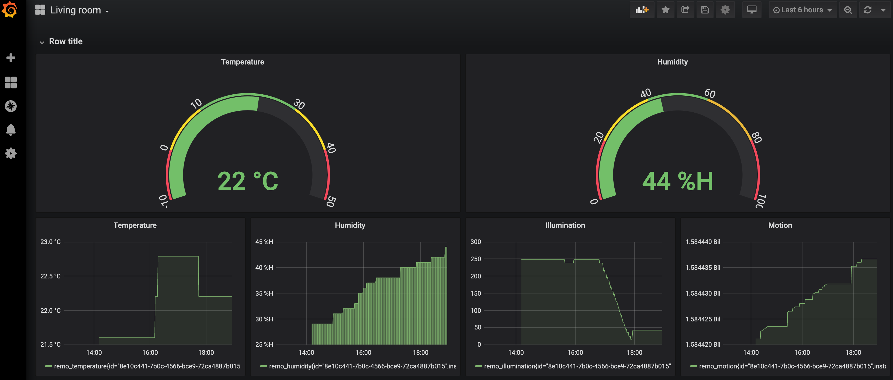

# Remo & Prometheus  & Grafana & Nginx

docker-compose file for using Nature Remo, Prometheus, Grafana and Nginx.



## Usage

Get nature remo auth token.
https://api.nature.global/login

```sh
$ git clone https://github.com/yoshiori/remo-prometheus-grafana-nginx.git
$ cd remo-prometheus-grafana-nginx
$ REMO_OAUTH_TOKEN=#{token} docker-compose up -d --build
```
